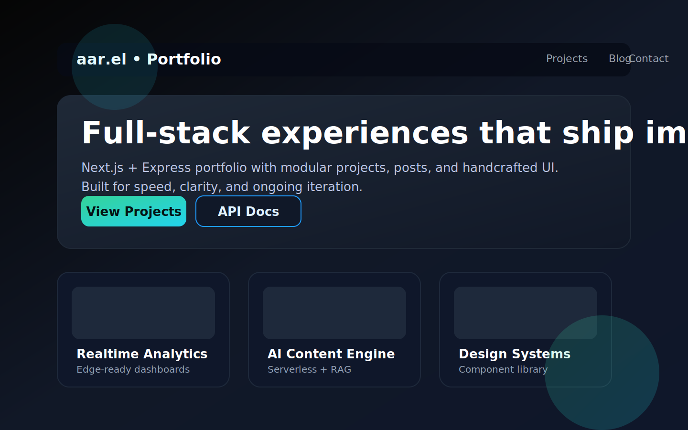

<!DOCTYPE html>
<html lang="en">
    <head>
        <meta charset="UTF-8" />
        <title>Portfolio Website README</title>
        
    </head>
    <body>
        <main class="shell">
            <header>
                <h1>Portfolio Website</h1>
                

                    A full-stack personal portfolio powered by Next.js 14, Tailwind, and an Express API.
                    Ship projects, posts, and case studies from a single codebase tuned for modern deployments.
                

                

                    Next.js 14
                    Express API
                    TypeScript
                    TailwindCSS
                    Monorepo Workflow
                

            </header>

            <figure class="hero">
                
                <figcaption>Homepage spotlight: navigation, hero headline, and project grid from the live UI.</figcaption>
            </figure>

            <section>
                

                    

                        <strong>Frontend</strong>
                        Next.js App Router, React Server Components, and Tailwind for rapid UI iteration.
                    

                    

                        <strong>Backend</strong>
                        Express service serving JSON content to the UI as REST endpoints.
                    

                    

                        <strong>Deployment Ready</strong>
                        Targets Vercel (frontend) and Render/Fly (backend) with matching build commands.
                    

                

            </section>

            <section>
                <h2>Features</h2>
                <ul class="list">
                    <li>
                        <strong>Modular components</strong>
                        Cards, layout primitives, and section builders live in `frontend/components`.
                    </li>
                    <li>
                        <strong>Dynamic content</strong>
                        Projects and posts stored in JSON (`backend/src/data`) and served through `api/projects` + `api/posts`.
                    </li>
                    <li>
                        <strong>Tailwind theming</strong>
                        Custom palette + typography in `frontend/tailwind.config.ts` with consistent utility ordering.
                    </li>
                    <li>
                        <strong>API growth path</strong>
                        Route handlers in `backend/src/routes` make it easy to bolt on auth, pagination, or filters.
                    </li>
                    <li>
                        <strong>Cross-platform hosting</strong>
                        Works offline, across LAN, or on cloud providers without config drift.
                    </li>
                </ul>
            </section>

            <section>
                <h2>Tech Stack</h2>
                <table>
                    <thead>
                        <tr>
                            <th>Layer</th>
                            <th>Technology</th>
                        </tr>
                    </thead>
                    <tbody>
                        <tr>
                            <td><strong>Frontend</strong></td>
                            <td>Next.js 14, React 18, TypeScript, TailwindCSS</td>
                        </tr>
                        <tr>
                            <td><strong>Backend</strong></td>
                            <td>Node.js 22, Express 5, TypeScript</td>
                        </tr>
                        <tr>
                            <td><strong>Styling</strong></td>
                            <td>TailwindCSS + custom theme tokens</td>
                        </tr>
                        <tr>
                            <td><strong>Data</strong></td>
                            <td>JSON files (`backend/src/data`)</td>
                        </tr>
                        <tr>
                            <td><strong>Deployment</strong></td>
                            <td>Vercel (frontend) + Render or Fly (backend)</td>
                        </tr>
                    </tbody>
                </table>
            </section>

            <section>
                <h2>Folder Structure</h2>
                <pre><code>portfolio-website/
├─ backend/
│  ├─ src/
│  │  ├─ routes/
│  │  │  ├─ posts.ts
│  │  │  └─ projects.ts
│  │  ├─ data/
│  │  │  ├─ posts.json
│  │  │  └─ projects.json
│  │  └─ server.ts
│  ├─ package.json
│  └─ tsconfig.json
└─ frontend/
   ├─ app/
   │  ├─ globals.css
   │  ├─ layout.tsx
   │  ├─ page.tsx
   │  └─ projects/[slug]/page.tsx
   ├─ components/
   │  ├─ Navbar.tsx
   │  ├─ Footer.tsx
   │  └─ ProjectCard.tsx
   ├─ lib/api.ts
   ├─ tailwind.config.ts
   └─ package.json</code></pre>
            </section>

            <section>
                <h2>Local Setup</h2>
                

                    

                        <strong>Clone</strong>
                        <code>git clone https://github.com/&lt;your_username&gt;/portfolio-website.git && cd portfolio-website</code>
                    

                    

                        <strong>Install</strong>
                        <code>cd backend && npm install && cd ../frontend && npm install</code>
                    

                    

                        <strong>Run backend</strong>
                        <code>cd backend && npm run dev</code> → `http://localhost:4000`
                    

                    

                        <strong>Run frontend</strong>
                        <code>cd frontend && npm run dev</code> → `http://localhost:3000`
                    

                    

                        <strong>Verify</strong>
                        Hit `http://localhost:3000` for the UI and `http://localhost:4000/api/projects` for API data.
                    

                

            </section>

            <section>
                <h2>Contributor Guide</h2>
                

                    Align with the standards outlined in
                    <a href="./AGENTS.md" target="_blank" rel="noreferrer noopener">AGENTS.md</a> for coding style, testing, linting, and PR formatting.
                

            </section>

            <section>
                <h2>Deployment (In Progress)</h2>
                

                    Production builds use `npm run build` in both `/frontend` and `/backend`. Lint the UI (`npm run lint` in
                    `/frontend`) and confirm both dev servers start cleanly before opening a PR or shipping to Vercel/Render.
                

            </section>

            <footer>
                Last updated with ❤️ to showcase the home experience front-and-center.
            </footer>
        </main>
    </body>
</html>
